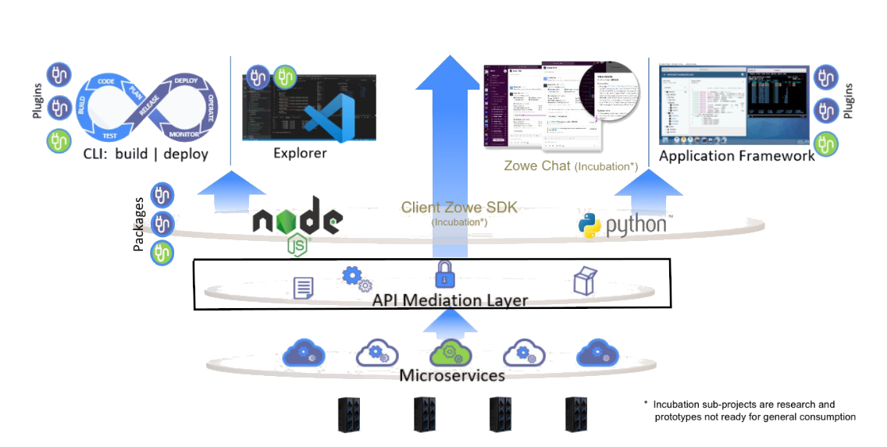

# Zowe 101 for API users

If I finish this course, I will be aware of the APIs and services within Zowe. I will be able to exploit them to build infrastructure applications simplifying self service in the infrastructure area. I will also be aware of other services that can be part of Zowe and are provided by extenders and I will know how and where I find more information about them. 

**Involved squads:** API ML Squad, Web UI Squad, Systems Squad, Zebra Squad

**Personas:** Junior zOS Application Developer, Senior zOS Application Developer, Hybrid Developer, Junior SRE

**Environments:** zOS System with Zowe installed, It’s probably possible to find a solution in the cloud. 

## Structure of the course

At the end of the course the students should be able to answer all the questions outlined below as well 
as be able to resolve a real world problem focusing on automation of the processes in the enterprise
using the Zowe APIs as well as the conformant APIs. 

This is where this chapter fits in the general image: 

### Chapter 1

This chapter will focus on APIs. What the API mean, How such API could look like, What is the role of the 
APIs in the current economy. 

It contains the examples of how real world APIs are used, including selection of mainframe ones, with examples 
from Zowe as well as from conformant extensions.

After this chapter the student should be able to answer:

- What is an API?
- What types of APIs are usually available?
- What is the difference between business and infrastructure APIs?
- What are the example use cases to use API?
- Where do I find Zowe Conformant APIs?
- Wy you should care about APIs?

### Chapter 2

This chapter focuses on the API Medation Layer. It discusses what components is the API Mediation Layer built of 
and the role of each of the components. 

- The API Gateway through which all the traffic passes. 
- The Discovery Service which collects information about all the APIs available in the system
- The API Catalog showing the list of available APIs including their documentation and the possibility to test their
  usage
- The Caching Service used for High Availability deployments
- Why you should use the API Mediation Layer?

After this chapter the student should be able to answer:

- What components is the API ML composed of?
- What is the role of each of the components?
- How do they interact to deliver the functionality?
 
### Chapter 3

Thic chapter focuses on the API Gateway. This is the service that handles all the external communication 
together with the authentication and authorization service. 

For the API Gateway it's important to understand Routing, Load Balancing, How Single Sign On is handled,
What information about onboarded services are available.

For the Authentication and authorization service it's important to understand what endpoints are available to
authenticate and verify, as well as what clients do we provide. Apart from that it's important to understand
what authentication is available northbound as well as what authentication is available southbound. 

After this chapter the student should be able to answer:

- How does the API Gateway routes the requests?
- What are the load balancing options and how do they reflect availability?
- How does the Netflix Ribbon limits requests on failing services together with retrying?
- What role API Gateway plays in Single Sign On?
- What API endpoints play role in authentication?
- What authentication methods are avilable northbound?
- What authentication methods are available southbound?

### Chapter 4

For the Discovery Service it's important to understand how do you onboard new service to the 
Discovery Service. Also where do I find information about the onboarded services and where
can discovery service help with debugging. 

After this chapter the student should be able to answer:

- How do I find whether my service is onboarded?
- Where do I get technical details about the service?
- How does the Discovery service works?
- What is the role of Discovery Service in HA setup?

### Chapter 5

For the API Catalog it's important to understand the authentication and what happens
when the password is expired. The student needs to understand how to look for the 
relevant APIs. 

It's also important to know that it's possible to use the wizard to onboard the APIs 
statically as well as validating and creating the configuration for dynamic onboarding. 

And that in the details of the APIs it's possible to compare the versions of the APIs
as well as trying the APIs against the real system and usage of the Code Snippets. 

After this chapter the student should be able to answer: 

- What can happen during the authentication?
- How do I use the static onboarding option to onboard internal infrastructure service?
- How do I use the Code Snippets and Try It Out functionality?
- How do I find the endpoint I care about across the onbaorded APIs?

### Chapter 6

This chapter is focused on sharing real world use cases using some of the APIs provided
by Zowe and the Conformant APIs. 

After this chapter the student should be able to resolve the actual real-world use
case using the APIs provided by Zowe as well as by the conformant services. 
